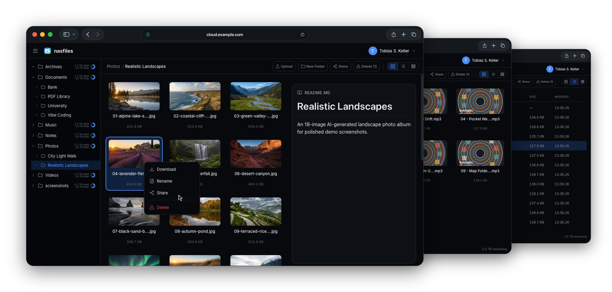
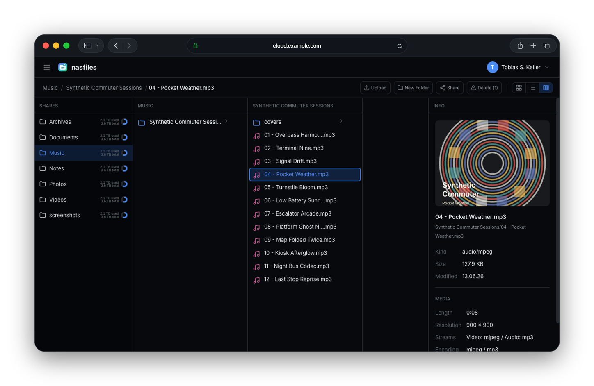
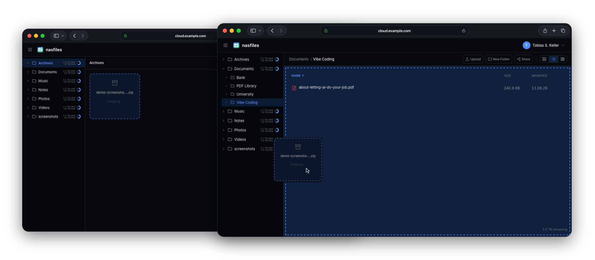
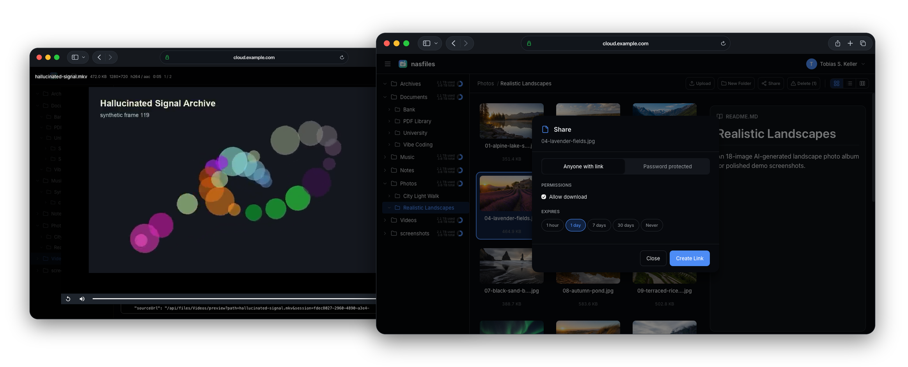
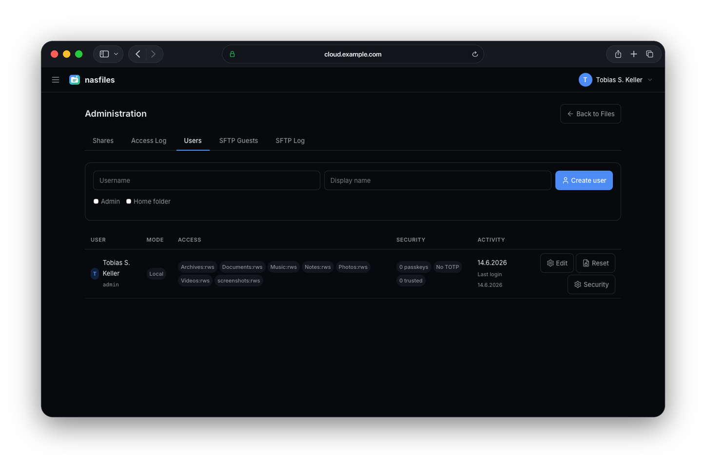

<p align="center">
  
</p>

<h1 align="center">NASFiles by Tobisk</h1>

NASFiles is a small, fast cloud solution & web file manager for your home server or small business file share.

It is not trying to replace full personal-cloud platforms like ownCloud or Nextcloud at least not on its own.

NASFiles focuses on the part that matters for many NAS-Style setups: a usable web-based file manager with cloud-like sharing, previews, uploads, and optional SFTP and secure guest access, all with a small footprint.

The underlying filesystem stays the source of truth. Your files remain normal files and folders, so the same content can still be served by SMB, NFS, SFTP, backup jobs, media tools, shell scripts, and the other services already running on your NAS.

## Why Try It

- User Experience comes first. We have everything you expect from a connected file manager in a very usable and user friendly way:
  - Preview images, video, audio, PDFs, Markdown, code, and archives in the browser
  - Switch between grid, list, and macOS-style column browsing
  - Manage your files with drag and drop, even across multiple browser windows
  - Sharing via public Link, with or without password or expiration date (and even with temporary SSH keys via SFTP), including access audit
  - Full virtual SFTP implementation. You only see the folders you have access to and never accidentally give users full SSH access.
  - Folder Readmes (just create a README.md in the folder)
- Great Operations Setup:
  - The file system is the source of truth. You mount the folders, everything else is done by the file system. No Duplication or outdated indexes.
  - Fully Local and Fully SSO/ OIDC support, including permissions to the mounts
  - Fully configurable with environment variables
  - single container deployment with very small resource footprint
- Focus on Security:
  - Full Audit logs
  - SFTP server for secure access
  - Support for PassKeys (FIDO2) and Password + TOTP. Trusted browser support.

We are not trying to replace Nextcloud, Dropbox, or a full document collaboration suite. We focus on the part the these originally became successful for - file management and sharing, but that with dedication and a way smaller footprint.



## Quick Start

The fastest production-like setup is Docker Compose with local users:

```bash
git clone <this-repository-url> nasfiles
cd nasfiles
cp docs/examples/compose.local.yml docker-compose.yml
mkdir -p ./data ./files
printf "NASFILES_HOST=%s\n" "files.example.com" > .env
printf "TRAEFIK_CERT_RESOLVER=%s\n" "letsencrypt" >> .env
printf "SESSION_SECRET=%s\n" "$(openssl rand -hex 64)" >> .env
printf "SETUP_ADMIN_PASSWORD=%s\n" "change-this-long-password" >> .env
docker network inspect proxy >/dev/null 2>&1 || docker network create proxy
docker compose up -d --build
```

Open `https://files.example.com`, sign in with the setup admin configured in the compose file, then create real users from the admin screen. The example assumes Traefik is already running with a `websecure` entrypoint and access to the external Docker network named `proxy`.

For complete setup guides, see:

- [Docker Compose with local users](docs/docker-compose.md)
- [Docker Compose with SSO/OIDC](docs/sso.md)
- [TrueNAS setup example](docs/truenas.md)
- [Configuration reference](docs/configuration.md)

## Features

### File Browsing

- Grid, list, and column views
- Folder tree and breadcrumbs
- Drag-and-drop uploads
- Folder uploads where supported by the browser
- Move, copy, rename, delete, and create-folder operations
- Streaming ZIP downloads for selected files or folders





### Previews

- Image thumbnails and image preview
- Video thumbnails, streaming, and range requests
- Audio playback with embedded cover art where available
- PDF thumbnails and preview
- Markdown and code previews
- Archive browsing and extraction when server-side execution is enabled



### Sharing And Access

- Public share links
- Password-protected guest shares
- Expiring links
- Optional upload permission on shares
- Share audit and admin visibility
- Temporary SFTP guests with folder-scoped access

### Authentication

- Local users with setup-admin bootstrap
- Passkey support
- TOTP support with trusted devices
- OIDC/SSO mode for identity-provider-backed deployments
- Group-to-folder permission mapping for SSO users



## How It Works

NASFiles mounts one or more host paths as named roots:

```text
COMMON_FOLDERS='{"Media":"/srv/media","Documents":"/srv/docs"}'
```

The server canonicalizes paths and keeps every operation inside the configured roots. The browser UI talks to the Rust API. Metadata, users, shares, SFTP guests, and thumbnail cache data live under `DATA_DIR` by default.

```text
Browser UI
   |
   v
NASFiles server
   |-- SQLite/Postgres metadata
   |-- thumbnail/cache data
   `-- configured host folders
```

## Deployment Notes

- Put NASFiles behind HTTPS for real deployments. The compose examples use Traefik labels for this.
- Set a stable `SESSION_SECRET`; changing it logs users out.
- Mount your data folders read/write only when users should be able to upload or modify files.
- Keep `DATA_DIR` on persistent storage.
- Install or include `ffmpeg` and `pdftoppm` if you want video/PDF thumbnails.
- Use `NO_SERVER_SIDE_EXECUTION=1` if you want to disable thumbnails, media transcoding, metadata probing, and archive extraction.

## Development

```bash
# Prerequisites: Rust and Node.js 22+
./scripts/dev.sh
```

For a local screenshot/demo environment:

```bash
./scripts/demo.sh
```

## License

MIT
